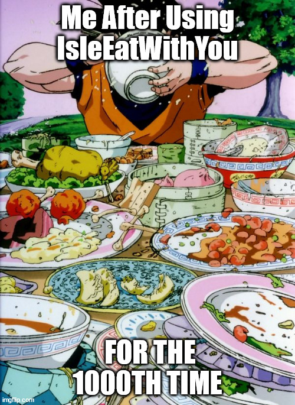

Created By: Gerardo Hernandez and Jason Enojardo

# The Problem 

University of Hawai'i at Manoa is one of the top 15 most diverse campuses in the United States.
As a result, there is a great deal of diversity in the food that students from all backgrounds and cultures know how to make.  Unfortunately, due to the cost of living, and often over-sized portion sizes that are made, it often happens that one person may make way too much food for themselves, or food that ends up going to waste.  Also, with the high cost of ingredients, it's easier and cheaper to cook larger batches of food.  How do we incentivize our undiscovered chefs to cook these great meals, and how do we find ways to get our student population to try these meals??  

# The Solution

All we need is to find a way for people to say... IsleEatWithYou!
The webpage allows students to sign up, and post cards of their "specialty dishes."  Included in the card will be the ingredients associated, and how many servings they plan on making (and when).  Users Logged in can add their name to have a plate of the meal.  A small contribution will go directly towards subsidizing the cost of ingredients for the chef.  Another way to look at the solution is micro-crowdsourcing for meals.   

# Pages that we would need

- Landing / About Page
- Upcoming Meals
- Sign up for a Chef Account
- Sign up for a Patron Account
- Chef Account: Meal Announcement
- Patron Account: IsleEatWithYou!
    
# Beyond the basics

- Support for some sort of Review System
- Conflict Resolution Page
- Chef Account: Extracting Payment to External Account
- Past Meals and Reviews
- Calendar system

# Use cases

Say a student knows how to make a great Paella.  Unfortunately, a UHM student will have a hard time finding ingredients (rice, paprika, saffron, mussels, shrimp, chicken, sausage, bell peppers) in a quantity that supports an average college student.  i.e. Finding ingredients for a serving of 1, would be unfeasible, wasteful, expensive, or some combination of the 3.  It would be more cost-effective for the student to make a 6-8 person serving IF there are another 5-7 people who would be willing to chip in and try new foods.  By signing up, students can flex their culinary skills, flex the diversity of their palettes, and minimize cost of food.

A "Chef" can create an account and post a meal that they can make.  Interested students--"Patrons"--can sign-up for a serving of that meal, in exchange for a small contribution towards the ingredient costs.  

