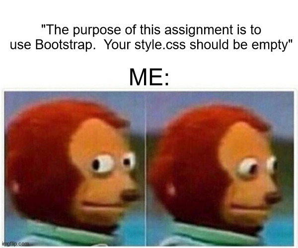

---
layout: essay
type: essay
title: "Are we Done with Bootstrap Yet?  Oh, Never?"
date: 2023-10*05
published: true
labels:
  - HTML
  - CSS
  - BOOTSTRAP5
---

# Are we Done with Bootstrap Yet?  Oh, Never?

## MySpace taught me HTML not Bootstrap

Learning UI frameworks has been a challenging mindset to get into in just 2 weeks.  Using HTML and CSS, one can accomplish anything visually on a webpage.  Even before CSS, we had raw html.  And there were millions of MySpace users that could code an entire page, with custom graphics, backgrounds, music, hover over effects.  Certainly, the idea of Bootstrap or a UI frameowkr other than using html wasn’t even a question.  Figure it out, they said.  Bringing in code, or font styles, or floating images has never needed a Bootstrap to help it function.  Honestly, Bootstrap seemed like more of a hindrance on these assignments.  So why is it still a great idea?  Even though I hate it?

## Because iPhones and iPads

Because iPhones and iPads.   While it may be comfortable to create in HTML/CSS, it is completely untenable to code for every size of monitor and every size of phone screen, and every zoom level of a page.  So even though it feels as though the world is more finite when using BootstrapB(as long as you stay off the CSS style sheet), you’re actually expanding the audience that you can reach with your created content.  During the exercises where we were formatting and re-formatting pages in Bootstrap, it would not take much effort of zooming in or resizing a window, to see that it's actaully very easy to misshape a browaser window to the point where your webpage is useless.  Below is a comparison of a webpage created amateurly and one done professionally(it's assumed).  The image on the left shows how upon making a window smaller, the menu button for "Location" decides to run off and do it's own thing.  The second shows the same wepage, but it is coded in a manner in which the integrity of the nav bar is maintained, and resizing occurs as one would expect for a professional website.  

## What exactly is there to dislike about Bootstrap 5?

There are plenty of obstacles which make the Bootstrap learning curve relatively steep.  The first is the lack of documentation.  It's understood that it is fairly new.  However, trying to google answers on the topic often resulted in either landing back at the bootstrap documentation, or shecodes website(most helpful one, if the topic is covered), or an occasional stack overflow conversation.  Emphasis on occasional.  Even the go-to handy AI tools showed their limitations because they could come up with answers, but those generated were for an older version of Bootstrap which is not the same.  Also, it becomes difficult to convey the specific issue that a quick search is meant to fix.  "How do I make my Buzz's banner over the background and not underneath it?"  Questions meant to provide simple debugging with AI are now more quickly solved by reading the limited documentation and taking a plunge on the text that it could be.  Step 1, wrap it in a container.  Step 2, make sure there are enough 
's at the end to get rid of the red circles.
  Despite my hesitations, it is important to note how essential Bootstrap is for making webpages more widely available.  

