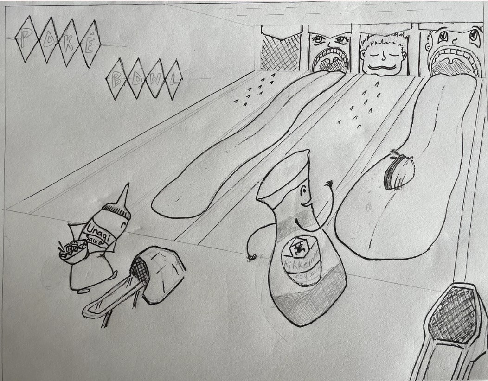
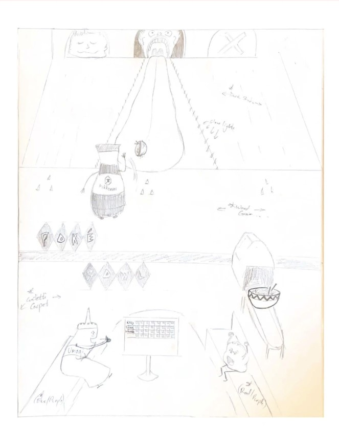
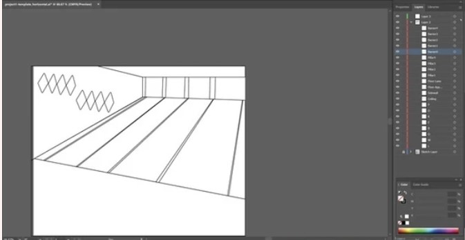
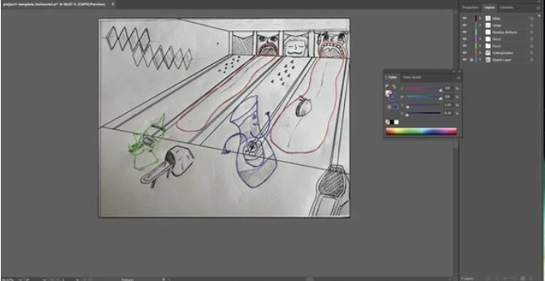

The goal of this project was to come up with a design, based on a vague prompt: Fantasy Food.  In order to implement the designed idea, it was necessary to start with multiple storyboards.  With each storyboard, a story and character design was created.  After posting and receiving peer feedback, one of the storyboards was chosen and created on Adobe Illustrator. 

As someone who is color-blind, a lot of effort had to be placed to getting the color scheme and shading correct.  The use of Hex color codes proved to be crucial in order to provide the color-scheme despite the fact that I can’t see the colors myself.   Layers were created in individual layers for the background, foreground, characters, lighting and objects.

This was a difficult project for me personally because it required engagement and feedback from my peers in open-forum format in order to complete.  This is incredibly uncomfortable when it comes to art itself, but to also be exposed to feedback of art created on a newly learned platform, made the discomfort even worse.  Overall, it turned out to be a supportive environment and I'm happy about the results. 
